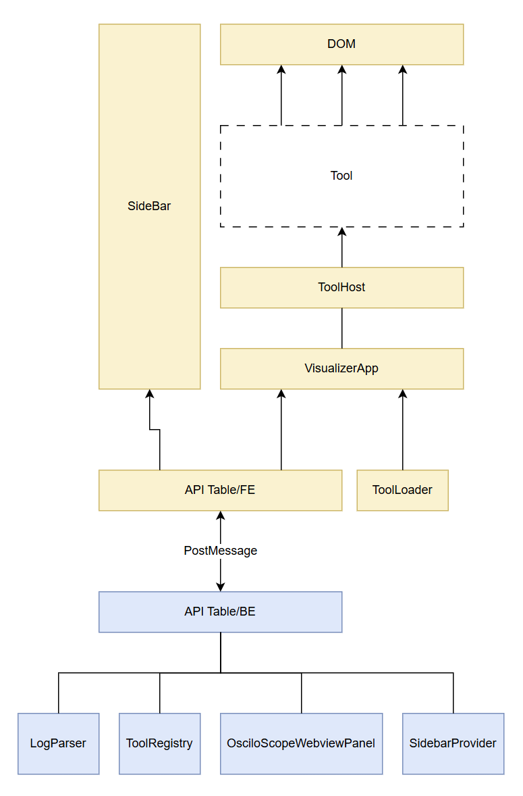
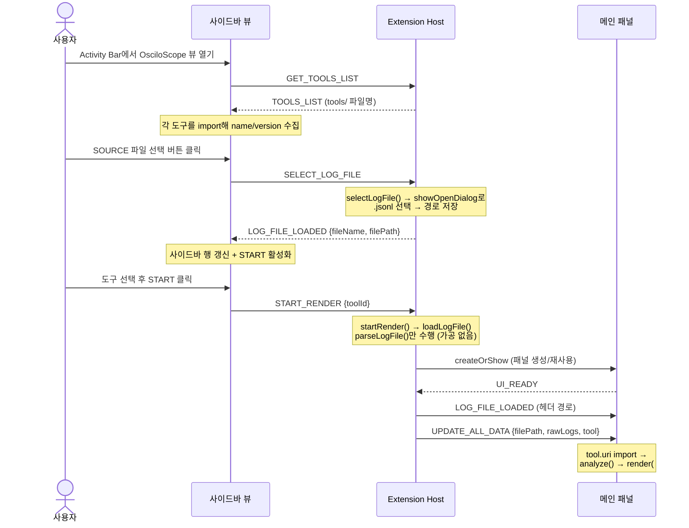

# 아키텍처

## 한눈에 보기

<p align="center">
  
</p>

위 그림은 주 렌더 경로(**파일·도구 선택 → 로그 파싱 → 메인 패널에 도구가 렌더**)에 실제로 관여하는
핵심 컴포넌트만 추린 것이다. 크게 세 층으로 읽는다.

- **웹뷰(프론트, 노란색)** — 위쪽. 왼쪽 `SideBar`는 파일·도구 선택 창구, 오른쪽은 메인 패널이다.
  메인 패널에서는 `VisualizerApp`이 `ToolLoader`로 도구를 불러와 `ToolHost`(ToolSession)에 넘기고,
  `ToolHost`가 도구의 `analyze/render`를 호출하면 **`Tool`이 `DOM`에 그림**을 그린다.
- **API Table 두 층 + `PostMessage`** — 가운데. 웹뷰는 `API Table/FE`, 확장은 `API Table/BE`라는
  단일 창구만 거쳐 통신한다. 바깥 컴포넌트는 raw 메시지를 직접 만들지 않는다.
- **확장 호스트(백엔드, 파란색)** — 아래. `LogParser`(파싱)·`ToolRegistry`(도구 스캔)와
  두 웹뷰 호스트(`OsciloScopeWebviewPanel`·`SidebarProvider`)가 `API Table/BE` 밑에 붙는다.

읽을 때 헷갈리기 쉬운 세 가지:

- **`Tool`은 점선이다** — 신뢰할 수 없는 사용자 코드라 API Table에 직접 닿지 못한다. 데이터는
  `ToolHost`가 `analyze(rawLogs)`/`render(mount)`의 **인자**로 떠먹여 준다(샌드박스, 아래 [도구는 웹뷰에서 돈다](#도구는-웹뷰에서-돈다)).
- **`API Table/FE`는 웹뷰마다 별도 인스턴스다** — 사이드바와 메인 패널은 격리된 런타임이라
  각자 하나씩 가진다. 그림에선 한 박스로 압축했다.
- **`API Table/BE`는 런타임 허브가 아니라 프로토콜 정본**(`ApiTable.ts`)이다 — 호스트들이 그
  `outbound/route`를 빌려 쓴다.

> 그림에서 생략한 것: 검사 패널(`ValidationPanel`·`ToolValidator`)·도구 생성(`ToolTemplate`)·
> `widgets`·글루(`util`·`constants`). 전체 목록은 아래 [모듈 구성](#모듈-구성) 참고.

아래부터는 이 그림의 각 층을 하나씩 파고든다.

## 두 개의 실행 컨텍스트

VS Code 확장은 서로 다른 두 프로세스로 나뉜다. OsciloScope도 이 경계를 그대로 따른다.

| 컨텍스트 | 위치 | 언어 | 역할 |
| --- | --- | --- | --- |
| **Extension Host** | `src/` (→ `dist/extension.js`) | TypeScript | 파일 선택/읽기·파싱, 도구 파일 스캔·생성, 뷰·패널 수명 관리 |
| **Webview UI** | `osciloscope/` | JS / HTML / CSS (ESM) | 사이드바·메인 패널 렌더링, **도구 실행**, 유효성 검사 |

두 컨텍스트는 직접 함수 호출이 불가능하고 `postMessage` 메시지로만 통신한다.
프로토콜은 [message-protocol.md](./message-protocol.md) 참고.

## 도구는 웹뷰에서 돈다

분석 기능은 **도구(tool)** 라는 플러그인으로 분리되어 있다. 도구는 브라우저 ES 모듈이고,
`analyze`(계산)와 `render`(표현) 두 훅을 내보낸다.

**확장은 도구 코드를 단 한 줄도 실행하지 않는다.** 목록에 표시할 이름·버전을 읽는 것조차
웹뷰가 `import`해서 한다. 이 배치의 이점은 사용자 코드가 Node 컨텍스트에 닿지 않는다는 점이다 —
파일 접근, 네트워크, 확장 API로 가는 통로가 구조적으로 없다.

| | 확장이 하는 일 | 웹뷰가 하는 일 |
| --- | --- | --- |
| 도구 파일 | 스캔·감시·생성·복사 | `import`·실행 |
| 로그 | 읽기 + `JSON.parse` | `analyze()`로 가공 |
| 화면 | 없음 | `render()`로 그리기 |
| 검사 | 패널 수명·타임아웃 | 12개 항목 실행 |

도구 작성 방법은 [plugin-tools.md](./plugin-tools.md)에 있다.

## 웹뷰가 셋이다

UI는 성격이 다른 세 웹뷰로 구성된다.

| 웹뷰 | 프론트 | 백엔드 | 하는 일 |
| --- | --- | --- | --- |
| **사이드바 뷰** | `osciloscope/sidebar-view/` | `SidebarProvider` (WebviewView) | 로그 파일 선택(SOURCE), START, 도구 목록·관리(TOOLS) |
| **메인 패널** | `osciloscope/` (`index.html`) | `OsciloScopeWebviewPanel` (WebviewPanel) | 헤더 + 도구 실행 영역 |
| **검사 패널** | `tool-host/ToolValidator.js` | `ValidationPanel` (임시 WebviewPanel) | 유효성 검사 실행 후 즉시 닫힘 |

사이드바 뷰는 Activity Bar에 상주하는 진입점이고, 메인 패널은 START를 누를 때 열린다.
검사 패널은 검사 버튼을 누를 때만 잠시 뜬다.

## 모듈 구성

### Extension Host (`src/`)

```
extension.ts               진입점. 프로바이더 등록 + loadLogFile 조율
├─ SidebarProvider.ts      사이드바 웹뷰 뷰. 파일 선택·START·도구 목록·관리 액션 처리
├─ LogParser.ts            로그 파일을 RawLog[]로 읽기만 한다 (가공하지 않음)
├─ OsciloScopeWebviewPanel.ts   메인 패널 생성/표시/메시지 브릿지 (정적 싱글턴)
├─ ApiTable.ts             프로토콜 단일 정본(CommandTypes·payload·ProtocolMap) + BE 송·수신
├─ WebviewSupport.ts       두 웹뷰가 공유하는 localResourceRoots·CSP 주입
└─ tool/
   ├─ types.ts             도구 도메인 타입(ToolInfo·검사) + 경로·패턴 상수
   ├─ ToolRegistry.ts      도구 파일 스캔·감시 (멀티루트·신뢰 처리)
   ├─ ToolTemplate.ts      스켈레톤 생성 · d.ts 배치 · 기본 도구 복사
   └─ ValidationPanel.ts   검사 전용 임시 패널 + 타임아웃 강제 종료
```

### Webview (`osciloscope/`)

```
index.html                 헤더 + #pluginRoot (도구 영역). CSP 메타 포함
js/
├─ main.js                 진입점: new VisualizerApp().init()
├─ VisualizerApp.js        메시지 수신 → 도구 로드 → analyze → render
└─ constants.js            CommandTypes (백엔드와 값이 일치해야 함)
css/ (layout / sidebar / timeline — 위젯 스타일은 .osc-widget 하위로 스코핑)

tool-host/                 도구 실행 기반 (두 웹뷰가 공유)
├─ ToolLoader.js           import + 캐시 무효화 + meta 수집 + 실패 처리
├─ ToolHost.js             helpers · widgets · ctx/host 생성 · ToolSession 생명주기
├─ ToolValidator.js        픽스처 주입 + 12개 검사 항목
├─ widgets/                layout · varList · timeline (기존 UI를 이관)
└─ fixtures/               검사용 표준 입력 5종

sidebar-view/              사이드바 뷰 프론트
├─ index.html              SOURCE / START / TOOLS 골격. CSP 메타 포함
├─ js/main.js              ESM. constants.js와 ToolLoader.js를 메인 패널과 공유
└─ css/style.css
```

번들 도구는 저장소 루트의 `tools/`에, 사용자 도구는 워크스페이스의 `.osciloscope/tools/`에 있다.

## 실행 흐름 (파일 선택 → 렌더링)

파일 선택 단일 진입점은 사이드바 뷰다. 커맨드 팔레트 커맨드는 없다.



> 메인 패널은 로드 완료 시 `UI_READY`를 보낸다. 그 전에 도착한 메시지(⑦)는 VS Code가
> 버퍼링하지 않아 유실될 수 있으므로, `OsciloScopeWebviewPanel`이 자체 큐에 모아뒀다가
> `UI_READY` 수신 시 flush한다. 자세한 내용은 [message-protocol.md](./message-protocol.md).

## 알아둘 설계 특성 / 제약

- **로그 파일은 사용자가 고른다.** 사이드바 SOURCE에서 `.jsonl`을 선택하고 START로 렌더한다.
  경로는 `SidebarProvider`가 들고 있다가 START 시점에 넘긴다.
- **웹뷰 리소스 범위가 넓어졌다.** 도구 파일을 로드해야 하므로 `localResourceRoots`에
  `tools/`와 워크스페이스 폴더가 포함된다. 대신 두 웹뷰 모두 CSP를 명시해 인라인 스크립트와
  외부 요청을 차단한다(`WebviewSupport.ts`).
- **`acquireVsCodeApi`는 우리가 선점한다.** 도구를 import하기 전에 호출하고 전역에서 지운다.
  한 번만 호출 가능한 API라, 이렇게 하면 도구가 확장으로 메시지를 보낼 수 없다.
- **패널은 정적 싱글턴.** `OsciloScopeWebviewPanel.panel`이 static이라 메인 패널은 하나만 존재.
  `onDidDispose`에서 참조·핸드셰이크 상태를 비워 재생성 가능하게 한다.
- **단방향 데이터 로딩.** 파일 변경 감시(watch)나 실시간 스트리밍은 없다. START 재실행으로 갱신.
- **가공은 도구가 한다.** 그룹핑·정체성 키잉을 확장이 하던 `transformData`는 사라졌고,
  기본 도구 `change-detector`로 옮겨졌다. 헬퍼(`varKeyOf`/`groupOf`)는 `ToolHost`가 제공한다.
- **도구는 하나만 실행된다.** 다중 선택, 도구별 설정값, 비동기 도구는 후속 과제다.
- **격리는 규약 수준이다.** 도구가 우리 웹뷰와 같은 문서를 공유하므로, 영역 밖 조작은
  유효성 검사로 걸러내지 구조적으로 막지는 못한다. iframe 격리는 후속 과제다.
