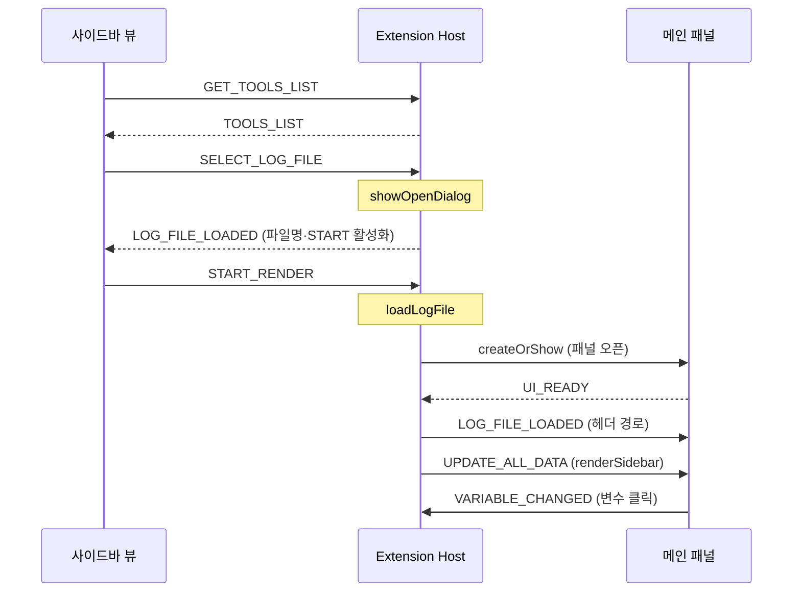

# 메시지 프로토콜 (Extension Host ↔ Webview)

Extension Host와 Webview는 `postMessage`로만 통신한다.
모든 메시지는 `{ command, payload }` 형태이며, `command`는 `CommandTypes` 값이다.

웹뷰가 둘이라 통신선도 둘이다:

- **메인 패널** `osciloscope/` ↔ `OsciloScopeWebviewPanel`
- **사이드바 뷰** `osciloscope/sidebar-view/` ↔ `SidebarProvider`

> **커맨드 문자열이 세 곳에 흩어져 있다.**
> - 정본: `src/OsciloScopeMessage.ts` (`enum CommandTypes`) — 9종 전부.
> - 메인 패널: `osciloscope/js/constants.js` — `START_RENDER`를 뺀 나머지를 미러링.
> - 사이드바 뷰: `osciloscope/sidebar-view/js/main.js` — 공유 상수 없이 문자열 리터럴을 직접 쓴다.
>
> 셋의 문자열 값이 일치해야 통신이 된다. 커맨드를 추가/변경하면 관련된 곳을 함께 고쳐야 한다.

## 메시지 봉투

```ts
interface OsciloScopeMessage {
  command : CommandTypes;
  payload : Object;
}
```

## 메인 패널 ↔ Extension Host

| command | 방향 | payload | 처리 |
| --- | --- | --- | --- |
| `UI_READY` | 패널 → ext | `{}` | ext: 로딩 완료 로그 + 버퍼된 메시지 flush |
| `UPDATE_ALL_DATA` | ext → 패널 | `transformData` 결과(그룹 구조) | 패널: 데이터 저장 + 사이드바 렌더 |
| `LOG_FILE_LOADED` | ext → 패널 | `{ fileName, filePath }` | 패널: 헤더 경로(`#hdrPath`) 표시 |
| `VARIABLE_CHANGED` | 패널 → ext | `{ varKey, varName }` | ext: 선택 변경 로그만 |

## 사이드바 뷰 ↔ Extension Host

| command | 방향 | payload | 처리 |
| --- | --- | --- | --- |
| `GET_TOOLS_LIST` | 사이드바 → ext | `{}` | ext: `ToolsProvider.listTools`로 `tools/` 나열 후 회신 |
| `TOOLS_LIST` | ext → 사이드바 | `{ tools: string[] }` | 사이드바: 도구 목록 렌더 |
| `SELECT_LOG_FILE` | 사이드바 → ext | `{}` | ext: `showOpenDialog`로 `.jsonl` 선택 |
| `LOG_FILE_LOADED` | ext → 사이드바 | `{ fileName, filePath }` | 사이드바: 파일명 표시 + START 활성화 |
| `START_RENDER` | 사이드바 → ext | `{}` | ext: 선택 경로로 `loadLogFile` 실행(메인 패널 렌더) |

> `LOG_FILE_LOADED`는 목적지가 둘이다. 파일 선택 직후엔 사이드바(행 갱신용)로,
> START 후 렌더 시엔 메인 패널(헤더 경로용)로 각각 보낸다.

## 시퀀스 (사이드바 → 메인 패널)



## 브릿지 구현 위치

- **메인 패널 송신**: `OsciloScopeWebviewPanel.sendDataToWebview` — 패널 없으면 에러 로그 후 무시.
  `UI_READY` 이전 메시지는 `pendingMessages`에 버퍼링했다가 flush.
- **메인 패널 수신**: `OsciloScopeWebviewPanel.receiveDataFromWebview` — `createOrShow` 시 1회 등록.
  `UI_READY`에서 버퍼 flush, `VARIABLE_CHANGED`는 `console.log`.
- **사이드바 송수신**: `SidebarProvider.resolveWebviewView`의 `onDidReceiveMessage`
  (`SELECT_LOG_FILE`/`START_RENDER`/`GET_TOOLS_LIST`) + `postMessage`(`LOG_FILE_LOADED`/`TOOLS_LIST`).
- **프론트 송수신**:
  - 메인 패널 `VisualizerApp` — `sendMessageToBackend`/`handleMessageFromBackend`.
  - 사이드바 `sidebar-view/js/main.js` — 단일 IIFE에서 직접 `postMessage`/`message` 처리.

## 확장 시 유의점

- **커맨드 값 3곳 일치**: 새 커맨드는 `OsciloScopeMessage.ts`(정본)에 넣고,
  메인 패널이 쓰면 `constants.js`, 사이드바가 쓰면 `sidebar-view/js/main.js`에도 같은 문자열로 반영.
- **`VARIABLE_CHANGED`는 현재 미소비**: 백엔드가 로깅만 하므로 선택 기반 후속 동작
  (예: 소스 라인 점프)은 여기에 로직을 붙이는 지점이다.
- **TOOLS는 UI만**: 도구 체크박스는 표시뿐이고 선택·실행 연동은 아직 없다.
