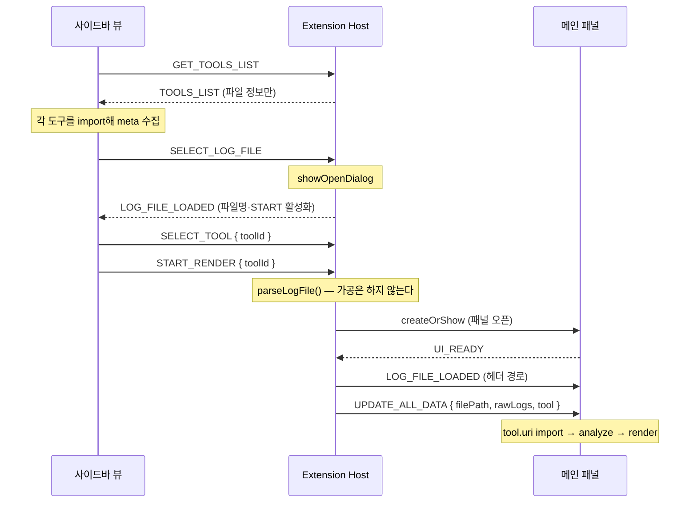

# 메시지 프로토콜 (Extension Host ↔ Webview)

Extension Host와 Webview는 `postMessage`로만 통신한다.
모든 메시지는 `{ command, payload }` 형태이며, `command`는 `CommandTypes` 값이다.

통신선은 셋이다:

- **메인 패널** `osciloscope/` ↔ `OsciloScopeWebviewPanel`
- **사이드바 뷰** `osciloscope/sidebar-view/` ↔ `SidebarProvider`
- **검사 패널** (임시) ↔ `ValidationPanel`

> **커맨드 문자열이 두 곳에 있다.**
> - 정본: `src/OsciloScopeMessage.ts` (`enum CommandTypes`) — 17종 전부.
> - 웹뷰: `osciloscope/js/constants.js` — 정본을 미러링. **사이드바 뷰도 이 파일을 import한다.**
>
> 두 곳의 문자열 값이 일치해야 통신이 된다. 커맨드를 추가/변경하면 함께 고쳐야 한다.

## 메시지 봉투

```ts
interface OsciloScopeMessage {
  command : CommandTypes;
  payload : Object;
}
```

## 메인 패널 ↔ Extension Host

| command | 방향 | payload | 처리 |
| --- | --- | --- | --- |
| `UI_READY` | 패널 → ext | `{}` | ext: 버퍼된 메시지 flush |
| `UPDATE_ALL_DATA` | ext → 패널 | `{ filePath, rawLogs, tool: { id, uri } }` | 패널: `tool.uri`를 import해 `analyze` → `render` |
| `LOG_FILE_LOADED` | ext → 패널 | `{ fileName, filePath }` | 패널: 헤더 경로(`#hdrPath`) 표시 |
| `TOOL_ERROR` | 패널 → ext | `{ toolId, message, phase }` | 패널: 안내 화면 표시 후 통지 (`phase`: `load`\|`analyze`\|`render`) |

> **`UPDATE_ALL_DATA`의 payload가 바뀌었다.** 예전에는 `transformData` 결과(그룹 구조)를 보냈지만,
> 이제 **원본 로그 + 실행할 도구**를 보낸다. 가공은 웹뷰에서 도구의 `analyze()`가 한다.
> 커맨드 이름은 유지했다 — "이 데이터로 패널을 다시 그려라"는 의미가 여전히 맞다.

> **`tool.uri`는 메인 패널 웹뷰 기준으로 만들어야 한다.** `asWebviewUri`가 만드는 URL은 웹뷰
> 인스턴스마다 다르다. `TOOLS_LIST`의 `uri`(사이드바 기준)를 재사용하면 로드에 실패한다.

> **`tool`에 `name`·`version`이 없는 이유:** 확장은 도구를 실행하지 않으므로 `meta`를 모른다.
> 메인 패널이 import 직후 `meta`를 읽어 헤더의 도구명을 채운다.

> **`VARIABLE_CHANGED`는 제거되었다.** 변수 선택은 이제 도구 내부의 관심사이고 확장이 알 필요가 없다.

## 사이드바 뷰 ↔ Extension Host

| command | 방향 | payload | 처리 |
| --- | --- | --- | --- |
| `SELECT_LOG_FILE` | 사이드바 → ext | `{}` | ext: `showOpenDialog`로 `.jsonl` 선택 |
| `LOG_FILE_LOADED` | ext → 사이드바 | `{ fileName, filePath }` | 사이드바: 파일명 표시 + START 활성화 |
| `START_RENDER` | 사이드바 → ext | `{ toolId }` | ext: 선택 경로 + 도구로 `loadLogFile` |
| `GET_TOOLS_LIST` | 사이드바 → ext | `{}` | ext: `ToolRegistry`로 스캔 후 회신 |
| `TOOLS_LIST` | ext → 사이드바 | 아래 참조 | 사이드바: 각 도구를 import해 meta를 채운 뒤 렌더 |
| `SELECT_TOOL` | 사이드바 → ext | `{ toolId }` | ext: 선택 도구 보관 |
| `CREATE_TOOL` | 사이드바 → ext | `{}` | ext: ID 입력받아 스켈레톤 생성 후 에디터로 열기 |
| `COPY_TOOL` | 사이드바 → ext | `{ toolId }` | ext: 기본 도구를 워크스페이스로 복사 |
| `OPEN_TOOL` | 사이드바 → ext | `{ toolId }` | ext: 도구 파일을 에디터로 열기 |
| `TOOL_CREATED` | ext → 사이드바 | `{ toolId, filePath }` | 사이드바: 새 도구를 선택 상태로 |
| `TOOLS_CHANGED` | ext → 사이드바 | `{}` | 사이드바: `GET_TOOLS_LIST` 재요청 |
| `VALIDATE_TOOL` | 사이드바 → ext | `{ toolId }` | ext: 검사 패널을 띄워 실행 |
| `VALIDATION_RESULT` | ext → 사이드바 | `ValidationReport` | 사이드바: 행에 결과 아이콘 |
| `TOOL_ERROR` | ext ↔ 사이드바 | `{ toolId, message, phase }` | 사이드바: 해당 행을 실패 표시 |

`TOOLS_LIST`의 payload — **확장은 파일 정보만 보낸다.** 이름·버전은 사이드바가 import해서 채운다.

```ts
{
  tools: Array<{
    id         : string;              // 파일명에서 추출 (<id>.tool.js)
    source     : 'builtin' | 'user';
    uri        : string;              // 사이드바 웹뷰 기준 asWebviewUri
    mtime      : number;              // ESM 캐시 무효화용
    overrides? : boolean;             // 같은 id의 기본 도구를 재정의한 사용자 도구
    error?     : string;              // 확장 단계에서 이미 실패 (ID 형식 위반, 멀티루트 중복 등)
  }>;
  trusted        : boolean;           // 워크스페이스 신뢰 — false면 사용자 도구 미로드
  workspaceReady : boolean;           // 워크스페이스 유무 — false면 '만들기' 비활성
}
```

> `START_RENDER`에 `toolId`를 실어 보내는 이유: 선택 상태는 `SELECT_TOOL`로도 저장하지만,
> START 시점에 함께 보내 사이드바와 확장의 상태 불일치를 없앤다. `toolId`가 없으면 확장이
> 기본 도구(`change-detector`)로 떨어뜨린다.

> `LOG_FILE_LOADED`는 목적지가 둘이다. 파일 선택 직후엔 사이드바(행 갱신용)로,
> START 후 렌더 시엔 메인 패널(헤더 경로용)로 각각 보낸다.

## 검사 패널 ↔ Extension Host

| command | 방향 | payload | 처리 |
| --- | --- | --- | --- |
| `UI_READY` | 검사 패널 → ext | `{}` | ext: `RUN_VALIDATION` 송신 |
| `RUN_VALIDATION` | ext → 검사 패널 | `{ toolId, toolUri }` | 패널: `runValidation()` 실행 |
| `VALIDATION_RESULT` | 검사 패널 → ext | `ValidationReport` | ext: 출력 채널에 상세, 사이드바로 중계 |

```ts
interface ValidationReport {
  toolId : string;
  ok     : boolean;                    // fail이 하나도 없으면 true (warn만이면 true)
  checks : Array<{
    name    : string;                  // '영역 격리', '렌더 결정성' 등
    status  : 'pass' | 'fail' | 'warn' | 'skip';
    fixture?: string;                  // 어느 픽스처에서 났는지
    message : string;                  // 실패 시 구체적 위치 포함
  }>;
}
```

`checks`는 **항상 12행**이고 검사 번호 순으로 정렬된다. 실행되지 않은 항목은 `skip`이다.
`toolUri`도 **검사 패널 웹뷰 기준**으로 만들어야 한다.

## 시퀀스 (사이드바 → 메인 패널)



## 브릿지 구현 위치

- **메인 패널 송신**: `OsciloScopeWebviewPanel.sendDataToWebview` — 패널 없으면 에러 로그 후 무시.
  `UI_READY` 이전 메시지는 `pendingMessages`에 버퍼링했다가 flush.
- **메인 패널 수신**: `OsciloScopeWebviewPanel.receiveDataFromWebview` — `createOrShow` 시 1회 등록.
- **사이드바 송수신**: `SidebarProvider.resolveWebviewView`의 `onDidReceiveMessage` + `postMessage`.
- **검사 패널**: `ValidationPanel`이 껍데기 HTML을 만들고 `runValidation`의 결과를 기다린다.
  15초 안에 안 오면 패널을 `dispose`하고 실패 리포트를 만든다.
- **프론트 송수신**: 메인 패널 `VisualizerApp`, 사이드바 `sidebar-view/js/main.js`.

## 확장 시 유의점

- **커맨드 값 2곳 일치**: 새 커맨드는 `OsciloScopeMessage.ts`(정본)와 `constants.js`에 같은
  문자열로 반영한다.
- **웹뷰별 URI**: 도구 URI를 넘길 때는 받을 웹뷰 기준으로 `asWebviewUri`를 호출해야 한다.
  한쪽 URL을 다른 쪽에 넘기면 로드에 실패한다.
- **`UI_READY` 핸드셰이크**: 웹뷰가 리스너를 걸기 전에 보낸 메시지는 VS Code가 버퍼링하지
  않아 유실된다. 메인 패널과 검사 패널 모두 `UI_READY`를 기다린 뒤 보낸다.
